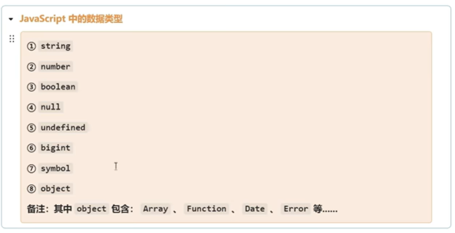
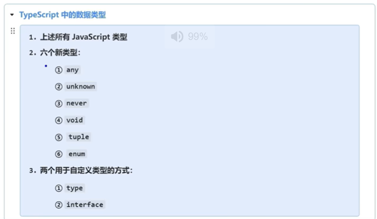
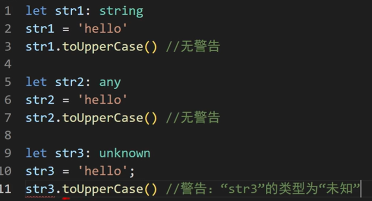
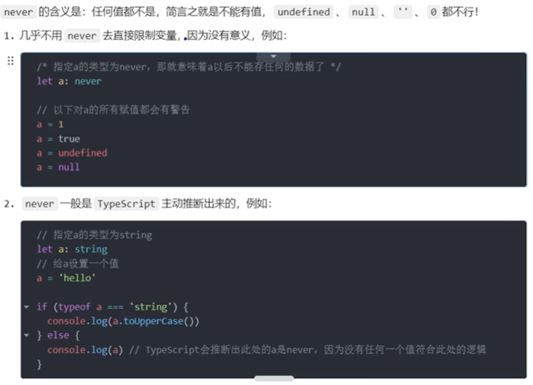
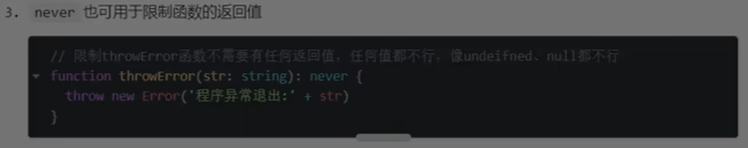
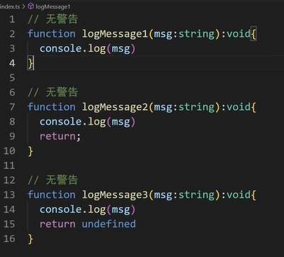
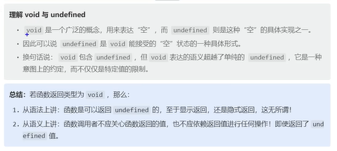
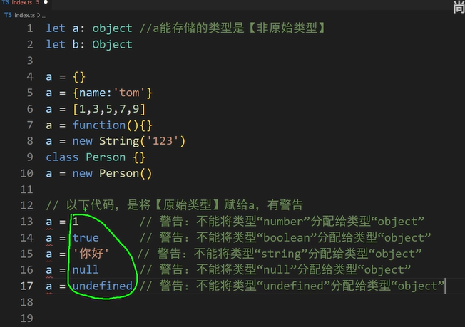
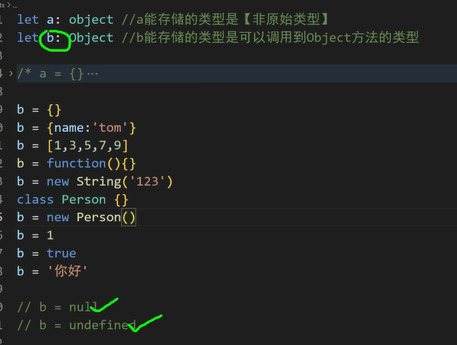

# TypeScript Learning Notes

## 基础篇

### 数据类型




#### any: 

任何数据类型，表示放弃自动数据类型检查

```TypeScript

// 明确数据类型为any， 放弃数据类型检查
let a: any
a = 99
a = 'hello'
a = false

// 如果不明确数据类型，自动默认为any并且放弃数据类型检查
let b 
b = 99
b = 'hello'

// any类型的变量可以赋值给任一类型的变量，非常诡异
// 尽量不要些any
let x: string
x = a 
console.log(x) // false
```

#### unknow

未知类型
- 可以理解为一个类型安全的any

```TypeScript
let a: unknown

a = false 
a = 99
a = 'hello'

console.log(a) // 'hello'

let x: string

x = a // 虽然a是string，因为类型是unknown, 不能直接赋值给x
```

- unknown 会强制开发者在使用前进行类型检查， 从而提供更强的类型安全
```TypeScript
let a: unknown

a = false 
a = 99
a = 'hello'

console.log(a) // 'hello'

let x: string

x = a // 虽然a是string，因为类型是unknown, 不能直接赋值给x

// solution 1
if (typeof a === 'string') x = a;

// solution 2 (断言)
x = a as string
x = <string> a
// solution 3
```

- 读取any类型数据的任何数据都不会报错，但是unknown会报错


#### never
不是定义变量，而是用于限制函数的返回值




#### void
- 不是定义变量，而是用于限制函数的返回值空
- 函数调用者不应该依赖其返回值做任何事
- undefined 也是void可以接受的返回值




#### 小object


#### 大Object
- 不能存null and undefined
- 几乎和any 差不多
- 大小object很少用


